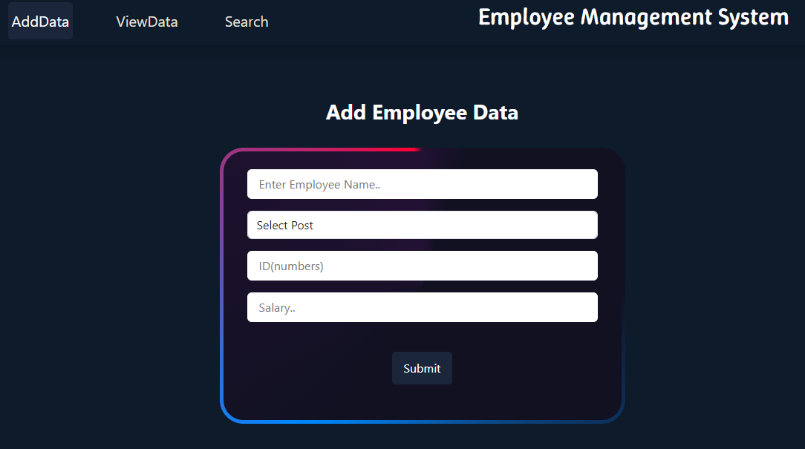

# Employee Management System

## UI/UX
<br>


## Overview

The **Employee Management System** is a simple web application built using HTML, CSS, and JavaScript. It allows users to add, view, edit, delete, and search employee records. The interface is styled with Bootstrap and custom CSS for a modern look.

## Features

- **Add Employee:** Enter employee details (Name, Department, ID, Salary) and add them to the system.
- **View Employees:** See all employees in a table with options to edit or delete each entry.
- **Edit Employee:** Update employee details using a modal dialog.
- **Delete Employee:** Remove an employee from the system.
- **Search Employee:** Search for an employee by name and view their details.
- **Responsive Design:** Works well on desktop and mobile devices.

## Project Structure

```
index.html
readme.md
asests/
    app.js
    style.css
```

- `index.html`: Main HTML file containing the structure and layout.
- `asests/app.js`: JavaScript file handling all logic for adding, editing, deleting, viewing, and searching employees.
- `asests/style.css`: Custom CSS for styling the application.
- `readme.md`: Project documentation.

## How It Works

### 1. Add Employee

- Navigate to the "AddData" tab.
- Fill in all fields: Name, Department, ID, and Salary.
- Click "Submit" to add the employee.
- If any field is empty, an alert is shown.

### 2. View Employees

- Click on the "ViewData" tab.
- All employees are displayed in a table.
- Each row has "Edit" and "Delete" buttons.

### 3. Edit Employee

- Click "Edit" on an employee row.
- A modal appears with the employee's current details.
- Update the information and click "Update" to save changes.

### 4. Delete Employee

- Click "Delete" on an employee row.
- The employee is removed from the table.

### 5. Search Employee

- Click on the "Search" tab.
- Enter the employee's name and click "Search".
- If found, their details are displayed; otherwise, "No Data Found!!" is shown.

## Technologies Used

- **HTML5**: Structure of the application.
- **CSS3 & Bootstrap**: Styling and responsive layout.
- **JavaScript**: Application logic and DOM manipulation.

## Getting Started

1. Clone or download the repository.
2. Open `index.html` in your browser.
3. Use the navigation tabs to add, view, edit, delete, or search employees.

## Customization

- You can add more departments by editing the `<select>` options in `index.html`.
- Modify styles in `asests/style.css` to change the look and feel.

## Limitations

- Data is stored in memory (JavaScript array) and will be lost on page refresh.
- No backend or persistent storage.

## License

This project is for educational purposes.

## Live Demo

https://employee-management-xi-virid.vercel.app/