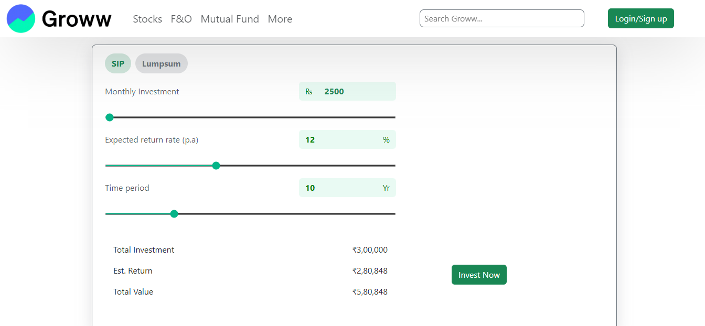

# SIP-Calculator

This project is a web-based SIP (Systematic Investment Plan) Calculator built using JavaScript. The SIP Calculator helps users estimate the future value of their investments made through regular monthly contributions. By entering the monthly investment amount, expected annual return rate, and investment duration, users can quickly calculate the maturity amount and total gains.

## UI/UX

 

## Features

- User-friendly interface for inputting SIP details
- Calculates total invested amount, estimated returns, and maturity value
- Visual representation of investment growth (if applicable)
- Responsive design for use on any device

## Usage

1. Enter your monthly SIP amount.
2. Specify the expected annual return rate (in %).
3. Enter the investment period (in years).
4. Click the "Calculate" button to view results.

## Technologies Used

- HTML
- CSS
- JavaScript

## Purpose

This tool is designed to help individuals plan their investments and understand the power of compounding through SIPs. It is ideal for anyone looking to manage their finances and make informed investment decisions.

## Live Demo

