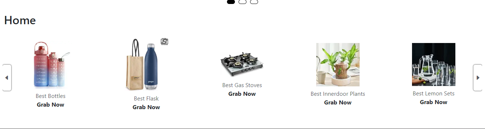

# PR-6 Slider Project

## Overview

This project is a simple and interactive **Image Slider** built using HTML, CSS, and JavaScript. It demonstrates how to create a responsive image carousel that allows users to view a collection of images with smooth transitions and navigation controls. The project is organized into separate folders for HTML, CSS, JavaScript, and images, making it easy to understand and maintain.

---
## UI/UX 


<br>


## Folder Structure

```
PR-6-Slider/
│
├── index.html
├── readme.md
├── css/
│   └── style.css
├── js/
│   └── app.js
└── img/
    ├── 1.png
    ├── 2.avif
    ├── 3.jpeg
    ├── bottles.webp
    ├── flask.webp
    ├── gasstow.webp
    ├── indoorplants.webp
    ├── lemonssets.webp
    ├── lunchbox.webp
    ├── miltonlunch.webp
    └── tawas.webp
```

---

## Features & Functionalities

### 1. **Image Slider/Carousel**
- Displays a series of images from the `img/` folder.
- Only one image is visible at a time, providing a clean and focused user experience.

### 2. **Navigation Controls**
- **Next** and **Previous** buttons allow users to navigate through the images.
- The slider loops back to the first image after the last one, and vice versa.

### 3. **Responsive Design**
- The slider is styled using `css/style.css` to be visually appealing and responsive on different devices.

### 4. **Smooth Transitions**
- CSS transitions are used for smooth sliding effects between images.

---

## JavaScript Functionalities (`js/app.js`)

### Main Functionalities:

- **Image Array Management:**  
  JavaScript maintains an array of image paths and tracks the current image index.

- **Event Listeners:**  
  The script adds click event listeners to the navigation buttons to handle user interaction.

- **Image Switching:**  
  When a navigation button is clicked, the script updates the displayed image by changing the `src` attribute of the image element.

- **Looping Navigation:**  
  If the user is at the last image and clicks "Next", the slider shows the first image. If at the first image and clicks "Previous", it shows the last image.

- **Dynamic Rendering:**  
  The slider can be easily extended to add or remove images by updating the image array in the JavaScript file.

---

## How to Use

1. **Open `index.html`** in your browser.
2. Use the **Next** and **Previous** buttons to navigate through the images.
3. The slider will loop through all images in the `img/` folder.

---

## Customization

- **Add/Remove Images:**  
  Place your images in the `img/` folder and update the image array in `js/app.js` to include their filenames.

- **Styling:**  
  Modify `css/style.css` to change the appearance of the slider.

---

## Credits

- Images used are for demonstration purposes and are stored in the `img/` folder.
- Developed as part of a JavaScript learning/practice assignment.

---

## License

This project is for