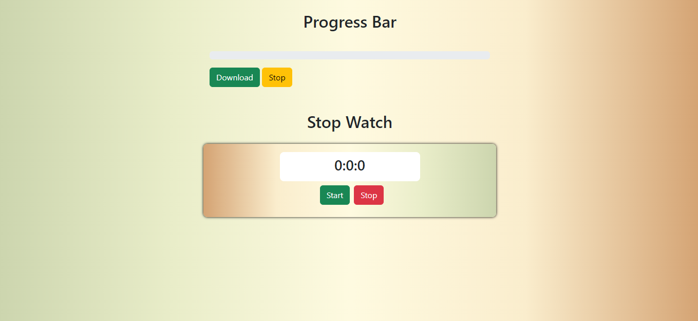
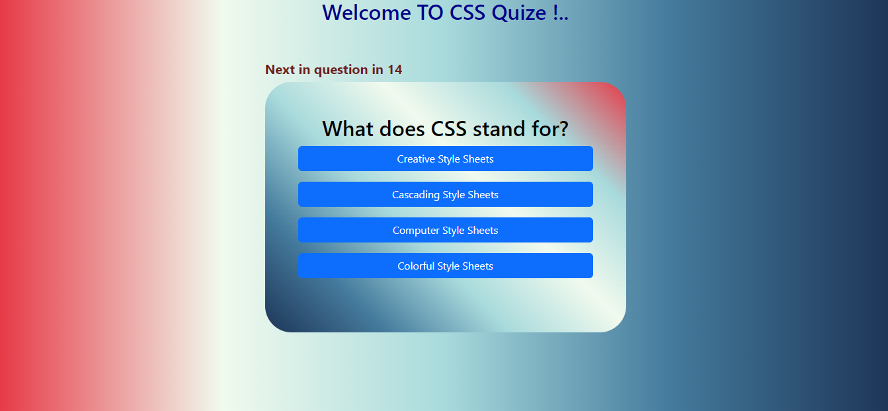
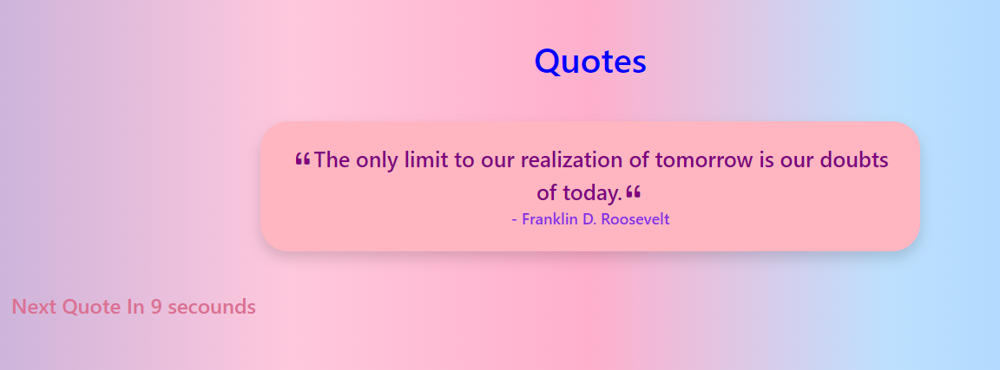

# JS-PR-7 Project

This project is a collection of interactive web applications built using HTML, CSS (Bootstrap), and JavaScript. Each folder contains a unique mini-project that demonstrates different aspects of front-end development, including UI design, DOM manipulation, and event handling.

## Table of Contents

- [Download & Watch](#download--watch)
- [Quize](#quize)
- [Quotes](#quotes)

---

## Download & Watch

**UI/UX**

**File:** [Download&Watch/Download-Watch.html](Download&Watch/Download-Watch.html)

This module features:
- **Progress Bar Simulation:** A visual progress bar that simulates a file download process. Users can start, stop, and resume the download, with real-time progress updates.
- **Stop Watch:** A digital stopwatch allowing users to start, stop, and reset the timer. Each stop records the time, which is displayed for the user.

---

## Quize

**UI/UX**

**File:** [Quize/quize.html](Quize/quize.html)

This module is a CSS quiz application:
- **Multiple Choice Questions:** Presents a series of CSS-related questions with four options each.
- **Timer:** Each question is timed, and the next question appears automatically after the timer ends.
- **Score Tracking:** Tracks and displays the user's score as they answer questions.
- **Immediate Feedback:** Users receive instant feedback on whether their answer was correct or incorrect.

---

## Quotes

**UI/UX**

**File:** [Quotes/quotes.html](Quotes/quotes.html)

This module displays motivational quotes:
- **Auto-Rotating Quotes:** Shows a new quote every 10 seconds, with a countdown timer indicating when the next quote will appear.
- **Author Attribution:** Each quote is displayed with its author's name.
- **Stylish UI:** Uses Bootstrap and custom styles for an appealing presentation.

---

## Project Conductance

The project is organized into separate folders, each containing a self-contained HTML file for a specific functionality. All applications use Bootstrap for responsive design and enhanced UI components. JavaScript is used for dynamic behavior, such as timers, progress updates, and interactive quizzes.

**How to Run:**
1. Open any of the HTML files ([Download&Watch/Download-Watch.html](Download&Watch/Download-Watch.html), [Quize/quize.html](Quize/quize.html), [Quotes/quotes.html](Quotes/quotes.html)) in your web browser.
2. Interact with the UI as described above for each module.

**Purpose:**  
This project demonstrates practical JavaScript skills, including event handling, DOM manipulation, and UI feedback, in the context of real-world mini-