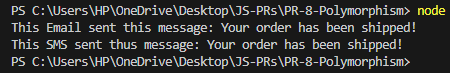
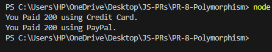
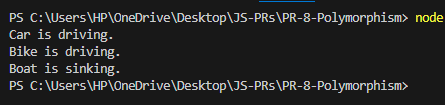
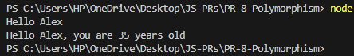
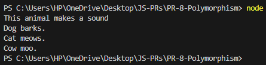
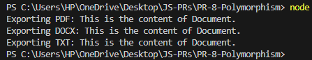
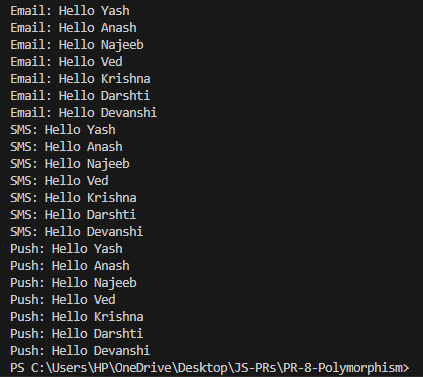
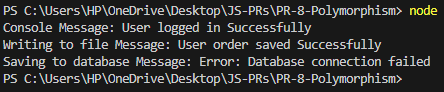
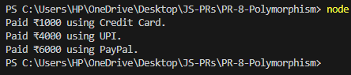
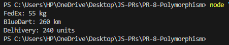

# JS-PRs: Polymorphism Examples

This repository demonstrates the concept of **polymorphism** in JavaScript using various real-world examples. Each code file (`prog1.js` to `prog10.js`) showcases a different scenario where polymorphism is applied, along with a corresponding image illustrating the output or concept.

---

## prog1.js - Notification System

**Description:**  
Implements a notification system with a base `Notification` class and two subclasses: `EmailNotification` and `SMSNotification`. Each subclass overrides the `send` method to provide specific behavior.

---

## prog2.js - Payment Methods

**Description:**  
Demonstrates payment processing using a base `Payment` class and subclasses `CreditCard` and `PayPal`. Each subclass customizes the `pay` method for different payment types.

---

## prog3.js - Vehicle Journey

**Description:**  
Shows polymorphism with different vehicle types (`Car`, `Bike`, `Boat`) each implementing a `Drive` method. The `startJourney` function accepts any vehicle and calls its `Drive` method.

---

## prog4.js - Function Overloading Simulation

**Description:**  
Simulates function overloading by checking the number of arguments in the `person` function, greeting the user differently based on whether the age is provided.

---

## prog5.js - Animal Sounds

**Description:**  
Defines an `Animal` base class and subclasses (`Dog`, `Cat`, `Cow`) that override the `speak` method to make different sounds, demonstrating runtime polymorphism.

---

## prog6.js - Document Exporters

**Description:**  
Implements a document exporting system with a base `DocumentExporter` class and subclasses for PDF, DOCX, and TXT formats, each overriding the `export` method.

---

## prog7.js - Multi-Channel Notifications

**Description:**  
Extends the notification example to include `EmailNotification`, `SMSNotification`, and `PushNotification`, each with their own `send` method. The `notifyAll` function sends notifications to a list of users.

---

## prog8.js - Logger Types

**Description:**  
Demonstrates polymorphism in logging with a base `Logger` class and subclasses for console, file, and database logging, each overriding the `log` method.

---

## prog9.js - Payment Processing

**Description:**  
Shows a payment processing system with a base `Payment` class and subclasses for credit card, UPI, and PayPal payments, each with their own `process` method.

---

## prog10.js - Shipping Cost Calculation

**Description:**  
Implements shipping cost calculation using a base `Shipping` class and subclasses for `FedEx`, `BlueDart`, and `Delhivery`, each providing their own `calculate` method based on order details.

---

Each example demonstrates how polymorphism allows objects of different classes to be treated through a common interface, enabling flexible